# ElectraX

Premium Electronics & Gaming E-Commerce Website built using React and Vite.

## Overview

ElectraX is a modern electronics e-commerce website featuring gaming laptops, keyboards, headsets, controllers, and accessories. The project focuses on creating a premium UI/UX experience using React.

## Features

* Modern Responsive UI
* Hero Section
* Product Categories
* Featured Products
* Product Details Page
* Shopping Cart
* About Page
* Contact Page
* Smooth Navigation

## Technologies Used

* React
* Vite
* React Router DOM
* JavaScript
* CSS

## Screenshots

### Homepage

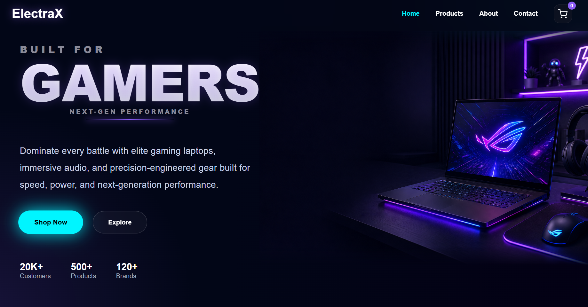

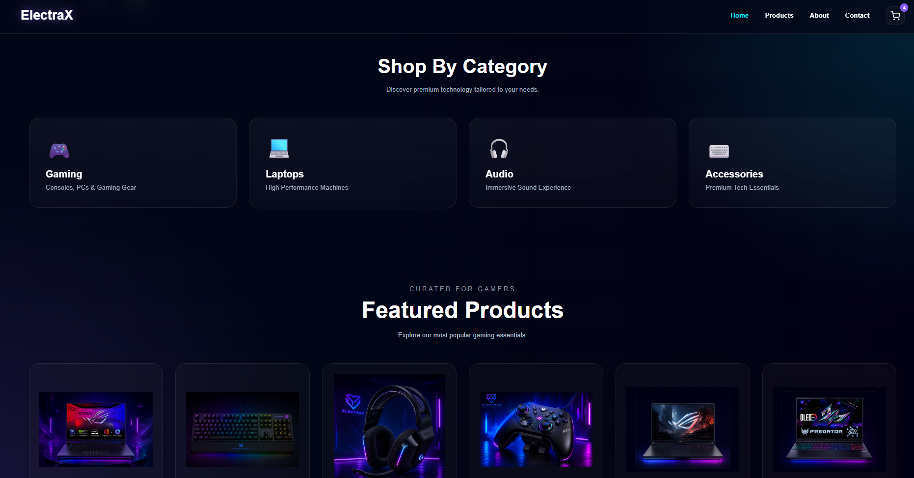

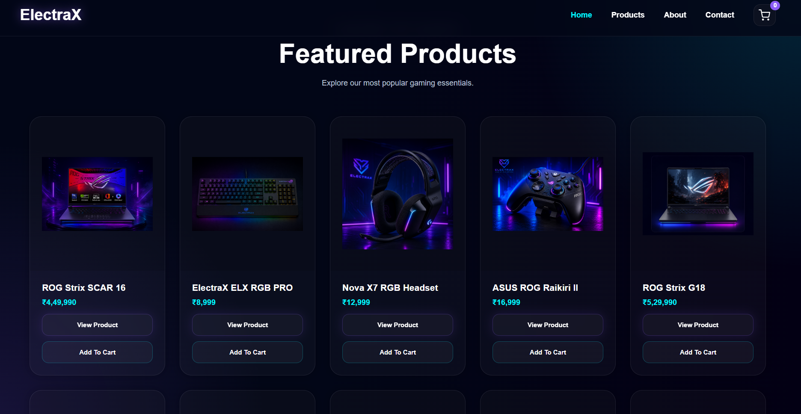

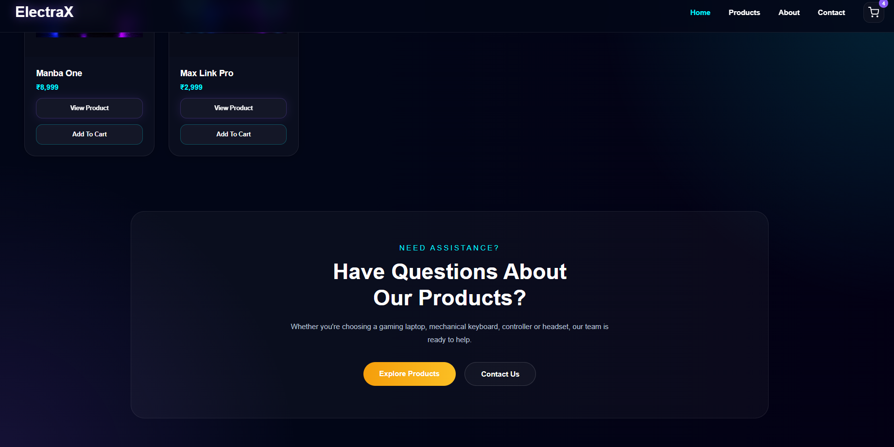

### Products Page

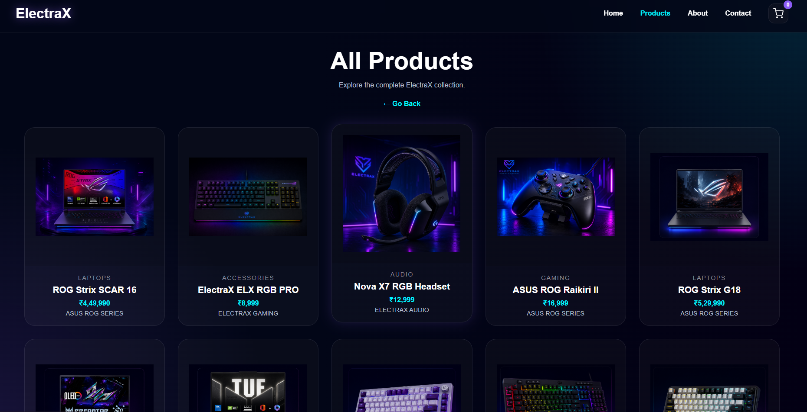

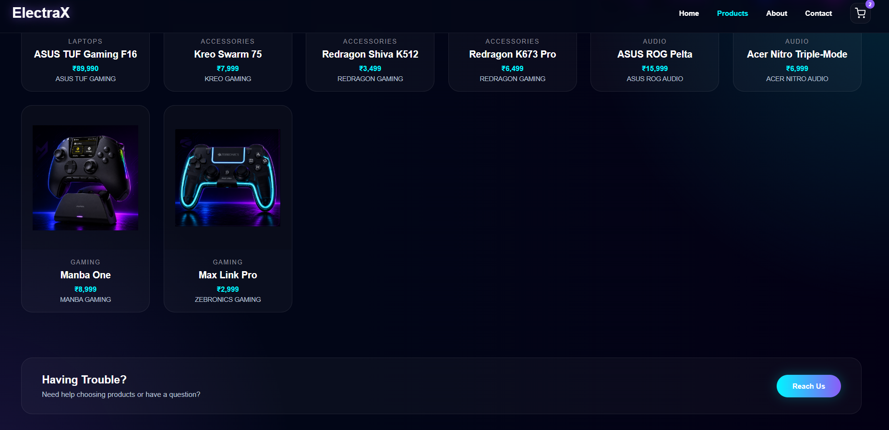

### About Page

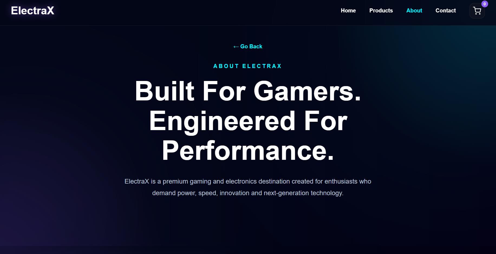

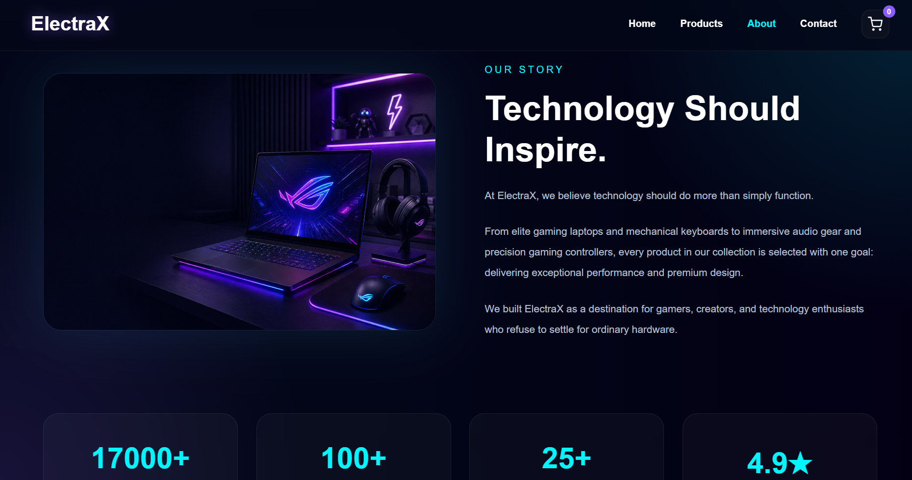

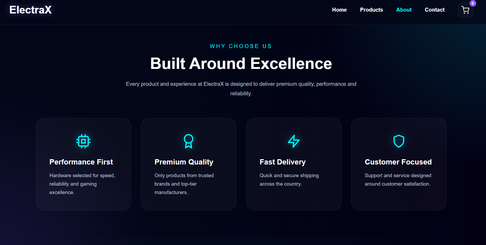

### Contact Page

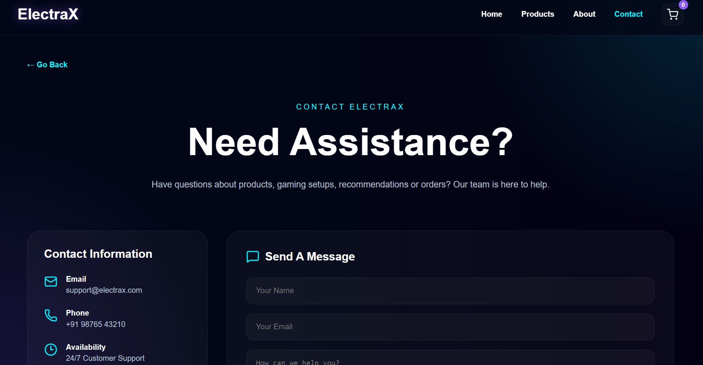

### Cart Page

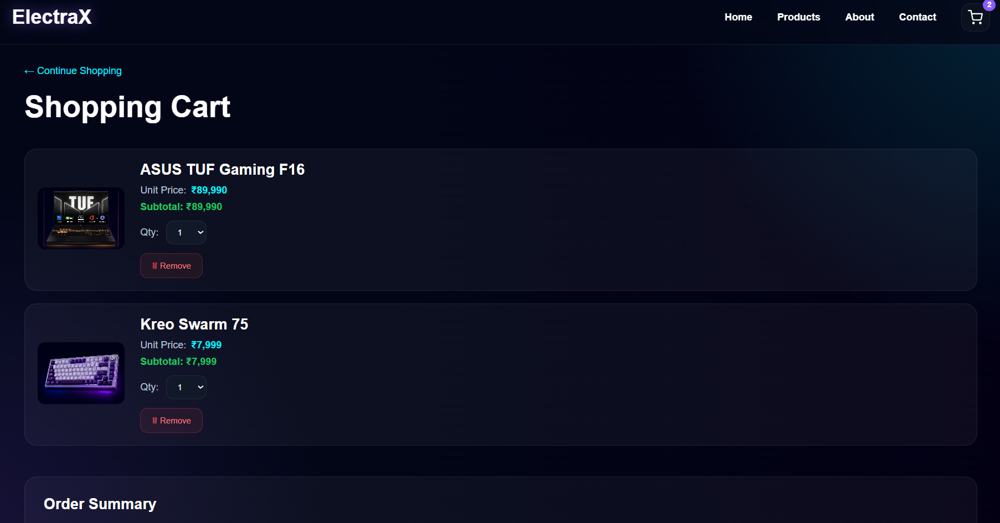

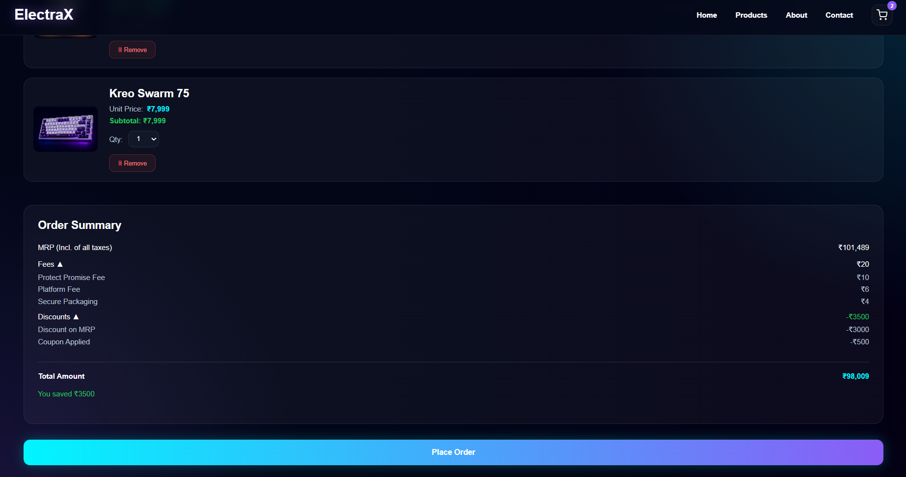

## Author

Rudra Sahani

Diploma Engineering Student
